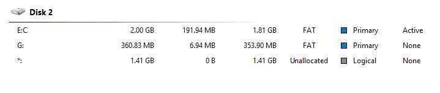

# 917 Program 

## Instalation

* Burn MSDOS Img on a flash or floppy...
* Install MS-DOS on the other HDD/FLash/...
* Copy 917 Archive File into the HDD/Flash except DOSFolder/COMMAND/IO/MSDOS files
* Then try
* If it didnt worked. Create another partition, under 500MB FAT - Primary, for `d:` drive
* Then try
* If didn't worked, edit AUTOEXEC or CONFIG.SYS

## Drives

* Need to be less than 2 GB
* 2 Partition - FAT - Primary



## AUTOEXEC

To run the app without machine use `cu m1 d2`, else `cu w d0 g1 m1`

## Unimportant stuff - Does not need to be exactly the same

* DOS folder
* COMMAND.EXE
* IO.SYS
* MSDOS.SYS

## CONFIG.SYS needed to merge

```
DEVICE=HIMEM.SYS /testmem:off /machine:1
rem  /machine:1 is for 917
rem FILES=30
rem BUFFERS=20

BUFFERS=30
FILES=40


DEVICE=cd1.SYS /D:banana

rem DEVICE=cd1.SYS /D:banana /P:1f0,14
rem DEVICE=cd1.SYS /D:banana /P:170,15
rem DEVICE=cd1.SYS /D:banana /P:170,10
rem DEVICE=cd1.SYS /D:banana /P:1e8,12
rem DEVICE=cd1.SYS /D:banana /P:1e8,11
rem DEVICE=cd1.SYS /D:banana /P:168,10
rem DEVICE=cd1.SYS /D:banana /P:168,9

LASTDRIVE=Z

rem 917
rem 917
rem 917

REM DEVICE=C:\DOS\EMM386.EXE I=B000-B7FF I=C800-EFFF d=32 NOEMS NOHI
DOS=HIGH
SHELL=C:\DOS\COMMAND.COM /P /E:512
DEVICE=C:\DOS\SETVER.EXE
DEVICE=C:\DOS\RAMDRIVE.SYS 8000 /E
```